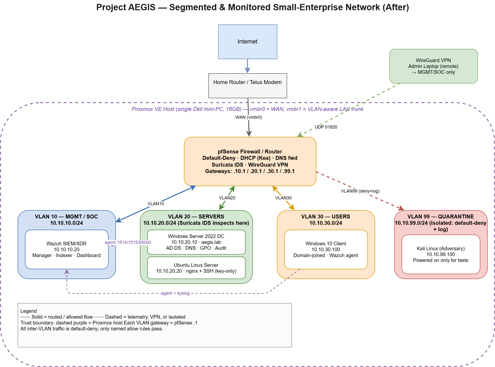
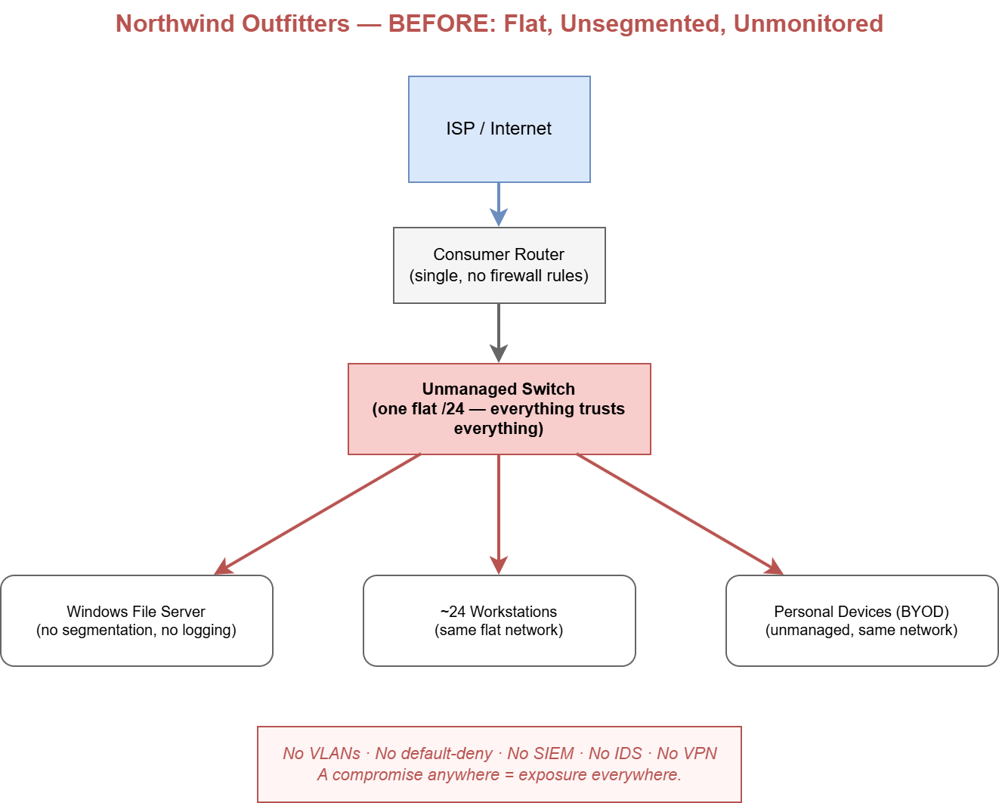

# Project AEGIS — Segmented & Monitored Small-Enterprise Network

> Designed, built, and defended a segmented small-enterprise network with centralized identity, SIEM monitoring, and network intrusion detection — then validated the defenses against live adversary activity. Built end-to-end on a single virtualization host for under CAD $200, in response to a portfolio-grade RFP modeling a real Network / Security Analyst engagement.

---

## The business problem

A fictional 35-person distributor (*Northwind Outfitters*) ran a flat, unsegmented network — one consumer router, a single file server, no segmentation, no logging, no intrusion detection. After a phishing scare and a failed cyber-insurance questionnaire, the mandate was to re-architect to a small-enterprise standard and stand up security monitoring. This project is my response to that RFP.

**Before:** flat `/24`, everything trusts everything, zero visibility.

**After:** four segmented VLANs, stateful default-deny firewall, Active Directory, a Wazuh SIEM ingesting host + firewall + IDS telemetry, and Suricata network IDS — with detections validated against a live adversary host.

---

## What I built

| Layer | Technology | Role |
|---|---|---|
| Hypervisor | Proxmox VE | Single-host virtualization; VLAN-aware bridge |
| Firewall / Router | pfSense | Default-deny segmentation, DHCP, DNS forwarding, WireGuard VPN |
| Identity | Windows Server 2022 (AD DS) | `aegis.lab` domain, OUs, GPOs, security auditing |
| SIEM / XDR | Wazuh | Agents on every host + firewall syslog + IDS alerts, one console |
| Network IDS | Suricata | ET Open ruleset, inter-zone inspection, tuned |
| Adversary | Kali Linux | Isolated in quarantine; used only for detection validation |

**Network segments:**

| VLAN | Zone | Subnet | Occupants |
|---|---|---|---|
| 10 | MGMT / SOC | 10.10.10.0/24 | Wazuh SIEM, admin access |
| 20 | SERVERS | 10.10.20.0/24 | Domain Controller, Linux app server |
| 30 | USERS | 10.10.30.0/24 | Domain-joined Windows client |
| 99 | QUARANTINE | 10.10.99.0/24 | Adversary host — isolated by default |

---

## Validated detections

Each detection was triggered with a real action from the isolated adversary host (or on the DC) and confirmed in the SIEM. Full evidence — attacker action + resulting alert, side by side — is in the [Detection Catalogue](detections/detection-catalogue.md).

| # | Attack action | Detection | Data source |
|---|---|---|---|
| 1 | TCP port scan (nmap) of the Linux server | Suricata scan alert, correlated to target host in Wazuh | Network IDS |
| 2 | SSH brute-force (hydra) against the Linux server | Wazuh correlation rule fires on repeated auth failures, correct attacker IP | Host agent (auth log) |
| 3 | New account created and added to **Domain Admins** | Wazuh detects account creation (4720) + privileged group change (4728) | Windows Security audit |
| 4 | Custom Suricata signature authored & loaded | Rule verified in engine; validation notes documented | Network IDS |

**Incident response:** After validating the SSH brute-force detection, I hardened the server to **key-only authentication** and confirmed password auth is refused — a documented detect → triage → remediate cycle. See the [Incident Report](docs/incident-report.md).

---

## Deliverables

- 📐 [Architecture diagram](docs/AEGIS_architecture_after.drawio.png) — VLANs, firewall, hosts, trust boundaries, allowed flows
- 📋 [IP addressing plan & VLAN table](docs/ip-plan.md)
- 🔥 [Firewall rule matrix with per-rule justification](docs/firewall-rule-matrix.md)
- 🔎 [Detection catalogue with evidence](detections/detection-catalogue.md)
- 🚨 [Incident report — SSH brute-force, end to end](docs/incident-report.md)
- 🛠️ [Full build log — every problem I hit and how I solved it](build-log.md)

---

## The hard parts (why this wasn't a tutorial follow-along)

The build log documents real diagnosis, not happy-path clicking. A few examples:

- **Proxmox couldn't see the disk** → traced to the motherboard's RAID mode; switched SATA from RAID to AHCI so the hypervisor could address the drive directly.
- **pfSense forwarded firewall logs but Wazuh never parsed them** → pfSense sends syslog with no hostname field, so Wazuh's pre-decoder misread the process name. Wrote a **custom decoder** matching the raw filterlog pattern.
- **Suricata IDS alerts fired on the wire but never reached Wazuh** → traced to EVE-JSON-over-syslog **truncating mid-object**, producing invalid JSON the decoder silently dropped. Resolved by trimming EVE output (no packet dumps / app-layer metadata) so the alert fit the syslog length limit and arrived complete.
- **Wazuh install left the host in a broken half-state** → performed a full manual teardown of lingering packages and a clean reinstall after fixing the disk constraint.
- **Ran the whole SOC on 16 GB RAM** → staged operation, powering the adversary host on only during tests, with per-VM RAM budgeting throughout.

---

## Skills demonstrated

Virtualization · VLANs & inter-VLAN routing · stateful firewalling & default-deny design · NAT · WireGuard VPN · Active Directory (AD DS, DNS, GPO, audit policy) · SIEM operations (Wazuh) · detection engineering · IDS tuning (Suricata) · log pipeline debugging · incident detection, triage & response · Linux & Windows administration.

---

*Northwind Outfitters is a fictional company; this is a training/portfolio project. All testing was confined to systems I own and built. Internal IPs shown are lab (RFC 1918) addresses.*
